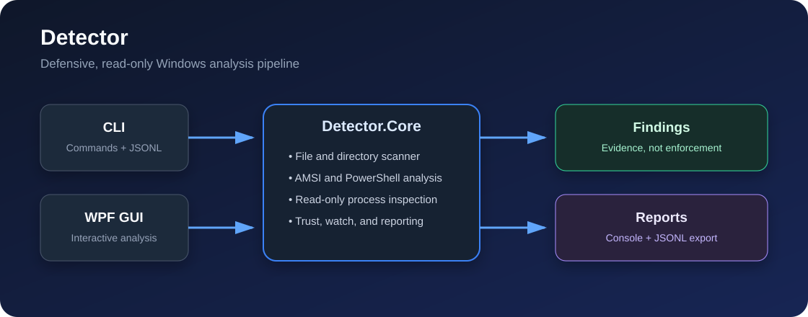

# Detector

Detector is a small Windows tool for investigating suspicious files,
PowerShell content, process metadata, and process memory. It is designed for
defensive analysis: it reads and classifies evidence without executing samples,
changing other processes, creating persistence, quarantining files, or deleting
anything.

## Project status

The repository contains the .NET 8 core, CLI, Windows WPF interface, safe
synthetic tests, and release-readiness checks. Detector remains an initial
source release rather than a production-proven endpoint-security product. Build
and verify the exact revision locally before relying on its output.



## Safety scope

- Use harmless synthetic inputs and official EICAR or AMSI test artifacts when
  verifying a deployment.
- A finding is evidence to investigate, not proof of compromise.
- Use the least privilege that provides the visibility you need. Protected or
  inaccessible processes can reduce coverage, so read informational messages
  before treating a clean summary as comprehensive.
- Detector is analysis software, not endpoint protection. It does not block
  attacks or replace an incident-response process.

## Architecture

| Component | Responsibility |
| --- | --- |
| `Detector.Core` | Read-only scanners, AMSI integration, PowerShell analysis, trust checks, reporting, and monitoring. |
| `Detector` | Command-line interface and optional JSONL output. |
| `Detector.Gui` | WPF interface over the same core scanning APIs. |
| `Detector.Tests` | xUnit tests using safe synthetic fixtures. |

AMSI verdicts come from the antimalware provider installed on the local
machine. If the Windows AMSI API cannot initialize, Detector reports the
failure and continues with its built-in heuristics. Initialization alone does
not prove that a provider will detect a particular sample; use `selftest` as a
safe pipeline check. Process-memory scans use read-only Windows APIs and may
not be able to inspect protected processes.

## Requirements

- Windows x64
- .NET 8 SDK to build and test
- An active AMSI provider for AMSI-backed verdicts
- Administrator privileges for fuller process-memory and ETW coverage

## Build and test

```powershell
dotnet build Detector.slnx -c Release
dotnet test tests/Detector.Tests/Detector.Tests.csproj
dotnet format Detector.slnx --verify-no-changes
```

## CLI

```text
detector scan-file <path>
detector scan-dir <path>
detector scan-ps <path|->
detector scan-proc <pid|all>
detector watch
detector monitor
detector selftest
```

Use `selftest` only with its built-in harmless verification strings. The
`--aggressive` process-memory option is intentionally noisy: JIT runtimes,
security products, and accessibility tools can legitimately use executable or
RWX memory. Do not turn a heuristic finding into an automated enforcement
decision.

## GUI

The WPF GUI offers the same file, folder, PowerShell, process, and monitoring
workflows with clear loading and error status, keyboard-accessible controls, and
JSONL export. Public screenshots are intentionally withheld until they can use
only synthetic paths and harmless results.

Launch it from the repository root:

```powershell
dotnet run --project src/Detector.Gui
```

## Limitations

- AMSI results depend on the provider and policy installed on the device.
- Process enumeration, ETW, WMI, and memory reads can fail because of
  privileges, protection level, Windows configuration, or a process exiting.
- Heuristics can miss threats and can flag legitimate software.
- Monitoring can miss short-lived events. Corroborate findings with trusted
  tools and established incident-response procedures.

## Security and contributions

Read [SECURITY.md](SECURITY.md) for responsible vulnerability reporting and
[CONTRIBUTING.md](CONTRIBUTING.md) before proposing a change.

## License

Detector is available under the [MIT License](LICENSE). This license covers the
original repository source and documentation, not Windows, AMSI providers,
third-party security products, or files inspected with Detector. Release and
provenance gates are recorded in
[release readiness](docs/release-readiness.md); they do not turn findings into
malware verdicts or guarantee complete host coverage.
