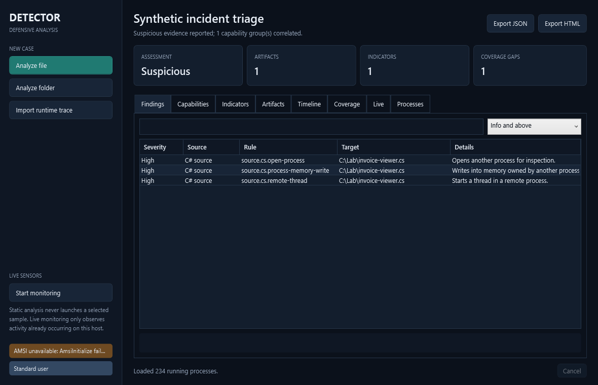

# Detector

Detector turns suspicious Windows files, source code, scripts, and exported
runtime events into a reviewable analysis case. It connects low-level findings
to likely capabilities, keeps track of what could not be inspected, and exports
the result as deterministic JSON or a self-contained HTML report.

It is built for first-pass Blue Team triage. Detector does not execute a sample,
make a verdict on behalf of an analyst, or pretend that a clean scan proves a
host is clean.



## What it does

- Profiles PE and managed .NET artifacts without loading their assemblies.
- Extracts assembly identity, target framework, sections, imports, P/Invoke and
  API families useful during triage.
- Reviews C# and PowerShell for process access, memory manipulation, remote
  threads, dynamic loading, persistence, credential access, download-and-run
  chains, and defense-evasion signals.
- Peels bounded PowerShell encoding layers and extracts URLs, domains, IPs,
  commands, registry paths, and file paths.
- Imports normalized JSONL or common Sysmon-shaped events from an isolated VM,
  then builds a process timeline without running the sample on the analyst host.
- Correlates related rules into plain-language capabilities with explicit
  confidence and supporting evidence.
- Records incomplete, unavailable, and failed modules beside the findings.
- Offers optional AMSI, read-only process-memory inspection, and ETW/polling
  sensors for activity already occurring on the current Windows host.

## A practical workflow

1. Put the unknown artifact and its runtime logs in an isolated analysis folder.
2. Open the folder in the workbench or run `detector analyze`.
3. Review high-severity findings, then the capability and indicator tabs.
4. Read Coverage before drawing conclusions; unavailable AMSI or inaccessible
   processes matter.
5. Export JSON for tooling or HTML for a hand-off. Preserve the original sample
   and its hash separately according to your incident-response process.

Detector never launches the selected artifact. Runtime behavior must come from
events captured elsewhere or from the optional live sensors observing the local
host.

## Requirements

- Windows x64
- .NET 8 Desktop Runtime for framework-dependent builds
- .NET 8 SDK when building from source
- Optional: an active AMSI provider
- Optional: Administrator rights for broader ETW and process-memory visibility

## Build and run

```powershell
dotnet restore Detector.slnx
dotnet build Detector.slnx -c Release
dotnet test Detector.slnx -c Release --no-build
dotnet run --project src/Detector.Gui -c Release
```

The GUI is the quickest route for interactive triage. Files and folders can be
dropped onto the window; `.jsonl` and `.ndjson` files are treated as runtime
evidence. The workbench keeps static evidence, imported events, and live sensor
results in separate views.

## Command line

Build a complete case for one file or a directory:

```powershell
dotnet run --project src/Detector -- analyze .\triage --report-json .\reports\case.json --report-html .\reports\case.html
```

Import events exported by a sandbox or Sysmon collection:

```powershell
dotnet run --project src/Detector -- import-trace .\events.jsonl --report-json .\reports\runtime-case.json
```

Focused scanners and sensors remain available:

```text
detector scan-file <path>
detector scan-dir <path>
detector scan-ps <path|->
detector scan-proc <pid|all> [--aggressive]
detector watch
detector monitor
detector selftest
```

Exit codes are `0` clean, `1` suspicious, `2` malicious, and `3` error. Report
files are created rather than silently overwritten. See
[the case schema](docs/case-schema.md) and
[runtime trace guide](docs/runtime-traces.md) before integrating the output.

## How to read a case

| Section | Meaning |
| --- | --- |
| Assessment | The strongest reported verdict plus a short coverage-aware summary. |
| Findings | Individual rules with severity, target, source, and concrete evidence. |
| Capabilities | Correlated behavior such as process injection or download-and-execute. |
| Indicators | Deduplicated values and the sources and contexts that produced them. |
| Artifacts | Hashes, type, trust, PE/.NET metadata, imports, and entropy. |
| Timeline | Normalized runtime events ordered in UTC when timestamps are present. |
| Coverage | What completed, what was partial, and what was unavailable or failed. |

A capability is a lead, not attribution. For example, a full process-access,
memory-write, and remote-thread chain is stronger than one isolated API name.
Detector preserves that distinction in the confidence and supporting-rule fields.

## Architecture

| Project | Responsibility |
| --- | --- |
| `Detector.Core` | Bounded artifact analysis, script rules, correlation, case model, exporters, AMSI and read-only sensors. |
| `Detector` | CLI commands, focused scanner output, and report creation. |
| `Detector.Gui` | Windows case workbench over the same analysis service. |
| `Detector.Tests` | Safe synthetic tests for parsing, limits, correlation, reports, CLI behavior, and the view model. |


## Deliberate limits

- Detector is not an EDR, antivirus replacement, sandbox, disassembler, or
  decompiler.
- It does not instrument or execute an unknown program. Imported events are only
  as complete and trustworthy as the system that captured them.
- AMSI results vary with the installed provider and policy.
- Signatures and heuristics can miss threats and can flag legitimate admin,
  accessibility, security, or JIT tooling.
- Protected processes, short-lived activity, event loss, permissions, and log
  shape differences can reduce visibility.
- Source analysis is lexical; it reports matched constructs and does not claim
  to prove the program's reachable runtime behavior.

These are operational facts, so Detector exposes them as Coverage instead of
hiding them in a debug log.

## Safety and contributing

Use harmless synthetic fixtures or official EICAR/AMSI test artifacts in public
issues and tests. Do not upload malware, credentials, dumps, or customer data.
Read [SECURITY.md](SECURITY.md) and [CONTRIBUTING.md](CONTRIBUTING.md) before
reporting a vulnerability or proposing a detector.

Detector is licensed under the [MIT License](LICENSE). See
[CHANGELOG.md](CHANGELOG.md) for release-candidate changes.
